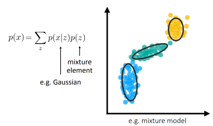
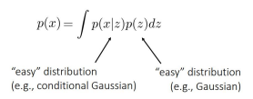

# Bayesian 관점에서 메타러닝 접근
- 배경: 대부분의 메타러닝 방법은 주어진 task specific parameter θi만 학습
- 문제: 그런데 동일한 few-shot 데이터를 보고도 다양한 가설을 가질 수 있음
- 해결: 분포로부터 샘플링. 즉, 다양한 가설을 생성하는 메타러닝 필요

## Intro
1. Latent variable models(잠재 변수 모델)
2. Variational inference(변분 추론)
3. Amortized variational inference(공유된 변분 추론)
4. Example latent variables models(잠재 변수 모델 예시)

### 메타러닝 inner loop가 갖추어야 할 알고리즘적 특성
1. 표현력
   - 함수 f가 다양한 학습 절차를 표현할 수 있는 능력
   - why? 확장성, 범용성
2. 일관성
   - 데이터가 많을 경우, 학습된 절차가 과제를 정확히 해결할 수 있는 특성
   - why? 학습에 사용된 task에 대한 의존성 감소, Out-of-distribution task에 대한 일반화
3. 불확실성 인식
   - 학습 중의 모호성에 대해 추론할 수 있는 능력

## Probabilistic models(확률 모델)

### 개념
- p(x): 데이터 x의 분포를 설명하는 확률 모델
- p(y|x): 조건부 확률 분포(입력 x에 대한 출력 y의 확률 분포)

- 흔하게 사용하는 분포 형태
  - Categorical distribution: 분류 문제에서 클래스별 확률
  - Gaussian distribution: 평균과 분산으로 연속 값을 예측

### 복잡한 분포가 필요한 경우는?
1. 생성 모델
   - 텍스트 설명으로부터 영상 생성
2. 레이블에 대한 불확실성 표현
   - 데이터가 적거나 일부만 관측되는 경우
3. 함수 자체에 대한 불확실성 표현
   - 입력 출력 관계가 여러 개의 가능한 함수로 설명될 수 있음.

### 잠재변수모델(Latent variable model) & 변분추론(Variational inference)
- Mixture model 기반 잠재 변수 모델
  - 여러 개의 간단한 분포(Gaussian 등)를 가중합으로 결합하여 복잡한 전체 분포를 구성할 수 있다.
  - 
- 연속 잠재 변수 z를 가지는 모델
  - 단일 분포로 표현이 어려운 데이터 분포 → 잠재 변수 𝑧를 도입하여 간단한 분포 두 개의 결합으로 표현 가능
  - 
- but, 잠재 변수 z를 도입하며 p(x)를 더 유연하게 표현할 수 있지만, 그에 따라 p(x)는 적분 형태가 되므로, 이 분포를 직접 학습(=MLE)하려 할때 계산이 어려워지는 문제가 발생한다.
- 즉 모델링의 유연성 확보 <-> 학습의 계산 복잡도 증가라는 트레이드오프가 생김. 이를 해결하기 위한 방법이 변론 추론이다.
  - 변분 추론은 잠재 변수를 직접 추정하는 대신, 기대값 형태로 근사한다.(분포 q(z)를 도입해 우도에 대한 lower bound를 구함)
  - 다시 말해, 변분 추론은 직접 계산이 어려운 logp(x) 대신 계산 가능한 하한(ELBO)을 최대화하여 학습 간으한 구조를 만드는 핵심 기법이다.
  - ELBO(Evidence Lower Bound)가 tight해지려면 KL divergence가 0이어야한다.

### Amortized variational inference
기존 변분 추론은 현실적인 문제점이 있다. 각 데이터에 대해 개별적인 최적화를 하려면 파라미터 수가 많아져 비효율적이다.

- 해결책
  - 각 x마다 개별 q(z)를 만드는게 아닌 공통된 인코더 네트워크 q(z|x)를 학습해서 파라미터를 줄이자(O(N) -> O(1))
- 장점
  - 간단한 구현
  - 낮은 분산
  - 효율적인 gradient 계산
- 단점
  - 연속 잠재 변수에서만 가능
  - 이산 분포에서는 적용 어려움 -> VQ-VAE, REINFORCE 등의 기법 사용

### VAE(Variational Autoencoder)
- VAE는 인코더와 디코더로 구성된 모델로, 인코더는 입력 데이터를 잠재 공간으로 매핑하고, 디코더는 잠재 공간에서 샘플링된 값을 기반으로 원래 데이터를 복원하는 구조
- 목적: 복잡한 데이터 p(x)를 잠재 변수 z를 통해 모델링
- 기법: Variational Inference + Reparameterization Trick
- 구조: 인코더-디코더 (Autoencoder 구조 + 확률적 추론)
- 확장: CVAE(Conditional VAE): 조건부 정보로 제어된 생성 가능

## Bayesian Meta-Learning
- 이게 왜 필요할까?
  - 기본 베이지안 메타러닝의 방식은
  - 장점
    - 간단함
    - 다양한 방법과 결합이 가능
  - 단점
    - 불확실성의 원인을 명시적으로 알 수 없음
    - 분포가 제한되고 추정이 부정확함

### Bayesian Black-box Meta-Learning
- 신경망이 잠재변수 분포를 근사하고, 샘플링해서 예측
- 장점
  - 복잡한 (Non-Gaussian) 분포도 표현 가능
- 단점
  - 여전히 Gaussian이어야 함

### Bayesian Optimization-Based Meta-Learning
1. Amortized inference
   - SGD로 분포의 평균/분산을 근사
   - 장점: 단순하고 빠름
   - 단점: Gaussian 가정 내재
2. Ensemble 방법
   - 방법 1: EMAML (Ensemble of MAMLs)
     - MAML을 여러 번 수행하여 다양한 파라미터를 얻고, 이들을 앙상블하여 최종 예측을 수행
     - 장점: 간단하게 non-Gaussian 표현 가능
     - 단점: 모델들이 충분히 다양하지 않으면 효과가 떨어짐
   - 방법 2: BMAML (Bayesian MAML with Stein Variational Gradient, SVGD)
     - MAML을 기반으로 Stein Variational Gradient Descent(SVGD)를 사용하여 posterior를 업데이트
     - 장점: 다양한 파라미터 분포를 유지하면서도 학습 가능, Non-Gaussian posterior 표현에 유리
     - 단점: M개의 파티클을 유지해야 하므로 메모리/계산량 증가
3. Hybrid inference(Probabilistic MAML)
  - 샘플링 기반 inference + optimization 기반 추론
  - 장점: 하나의 모델만 사용하면서 비정규 posterior 표현 가능
  - 단점: 학습 복잡도 증가

### 베이지안 메타러닝 평가
불확실성을 얼마나 잘 다루는지에 맞는 문제와 지표가 필요
- MiniImagenet Accuracy
  - 장점
    - 표준화된 데이터셋
    - 실제 이미지 사용
    - 모델이 기본은 잘 작동하는지 확인 가능
  - 단점
    - 정확도는 불확실성을 측정하지 않음
    - 일부 task는 모호성 없음
    - 불확실성이 실제 task에 도움이 안될 수도 있음