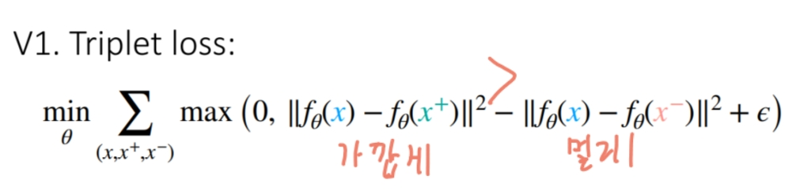
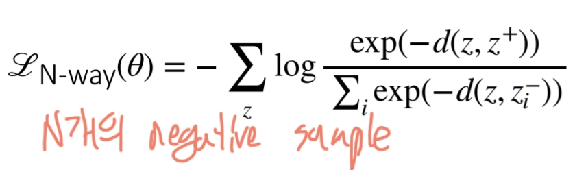

# Contrastive Learning
비슷한 데이터는 가깝게, 다른 데이터는 멀게 임베딩(embedding) 공간상에서 위치하도록 학습하는 방식입니다. 주로 라벨이 없는 데이터를 활용하여 유의미한 특징을 추출할 수 있어서, **자기지도학습(self-supervised learning)** 에 자주 사용됩니다.

- 왜 대조학습은 큰 배치사이즈를 가지는게 좋을까?
  - 의미있는 negative를 가져올 수 있기 때문이다.
  - 메모리와 같은 리소스 한계가 있을 수 있다.
    - 이전 배치를 가져오는 momentum contrast
- augmentation을 하는 방법을 학습하는 방법이 있다.
- 비디오인 경우 근처 프레임을 가져와서 하는 방법도 있다.

## formal
### simple

### N-way

## 장단점
- 장점
  - 라벨이 없는 데이터로도 학습할 수 있다.
  - 다양한 데이터에 적용 가능하다.
  - 증강을 통해 도메인 지식 통합 가능
- 단점
  - negative sample을 잘 선택해야 한다.
  - argumentation을 잘 튜닝해야한다.
  - batch size를 크게하기 쉽지 않다.