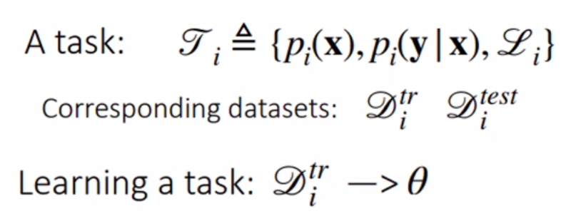
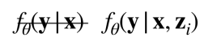
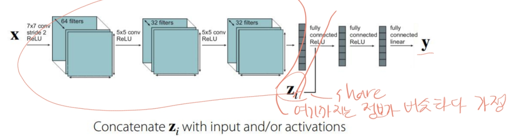
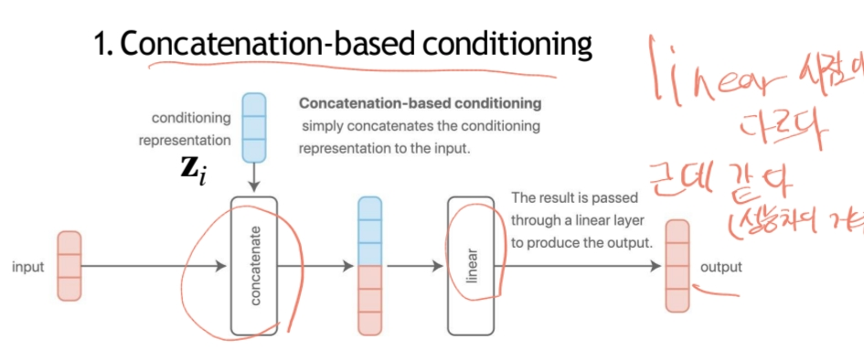
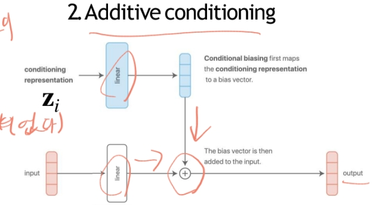
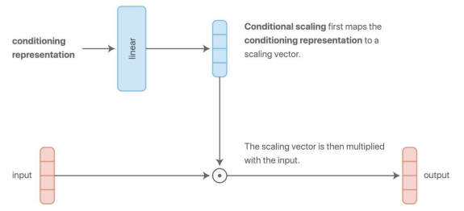
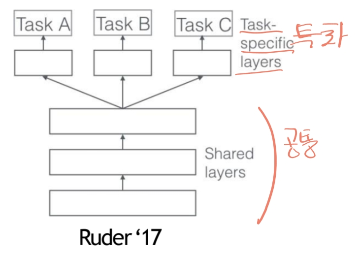
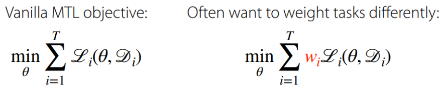
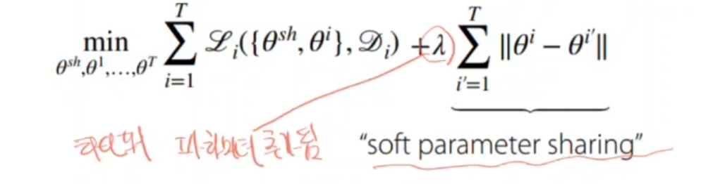

# Intro

## Why Multi-task Learning & Meta-learning?
- 전통적인 학습: 하나의 작업을 처음부터 학습
- 현실: 새로운 환경/작업에 빠르게 적응해야 함
- 인간은 Generalist, 기계는 Specialist → 일반화 필요
- 대규모 데이터 부족, Long-tail 문제, 빠른 적응 요구
- 이에 대한 해결책: 멀티태스크 학습, 메타러닝, Few-shot Learning

## 핵심 주제
### Multi-task Learning (MTL)
- 여러 작업을 동시에 학습하여 효율 향상
- 예: 추천 시스템, 다중 언어 번역 등
- Shared structure(공통 구조)를 이용함
- 수식
  - 
  - 
  - 모델을 Zi에 어떻게 조건화해야 할까요? 모델의 어떤 매개변수를 공유해야 할까요?
  - task마다 모델을 따로 가져가는 것은 공유가 없어서 좋은 방식이 아니다.
  - 아래와 같이 적당한 최적의 지점을 찾는게 좋다.
  - 
- z conditioning 방식의 4가지 종류.
  1. Concatenation-based Conditioning
     - Task-specific 벡터 또는 embedding을 공유 표현 z에 단순히 concat하여 입력으로 사용
     -  
  2. Additive Conditioning
     - input과 z를 각각 linear layer를 통과시켜서 더한 후, 출력
     - 
  3. Multiplicative Conditioning
     -  input과 linear layer를 통과한 z를 곱한 후, 출력
     - 
  4. Multi-head Architecture
     - 공통레이어와 각 task별 레이어를 나눈다.
     - 

#### Objective function

어떻게 wi를 선택해야 할까?
- 중요도 또는 우선순위에 따라 수동으로
- 훈련 전반에 걸쳐 동적으로 조정

#### Optimizing the objective
1. task의 미니배치 샘플링
2. 각 task에 대한 데이터포인트 미니배치 샘플링
3. 미니배치에서 로스 계산
4. 역전파를 통한 기울기계산
5. 선호하는 신경망 최적화도구를 사용하여 기울기 적용

#### Multi-Task Learning의 주요 Challenges
- Task 간 Negative Transfer(부정적 전이)
  - 서로 다른 작업 간의 지식 공유가 오히려 성능 저하를 초래
  - 그렇다면 덜 공유해보자
  - 매개변수 공유의 더 유동적인 정도를 허용합니다.
  - 
- overfitting
  - 충분히 공유하지 않을 경우 오버피팅 발생
  - 더 공유해서 해결
- task가 너무 많다면?
  - 아직 연구중

#### Case Study
- YouTube 추천 시스템
  - input : 현재 보고 있는 비디오(query video), user features
  - output : 후보 비디오에 대한 맞물림(클릭 여부), 만족(좋아요 클릭, 별점)

### Transfer Learning
- 이전 작업의 지식을 활용하여 새로운 작업에 빠르게 적응

### Meta Learning (Learning to Learn)
- 학습 알고리즘 자체를 학습
- 데이터 부족 시대에서 학습 일반화가 중요해짐
- 빠른 적응, few-shot 학습 가능

### 대표 기법
- 블랙박스 접근법 (Black-box approaches)
- 최적화 기반 메타러닝 (Optimization-based meta-learning)
- 메트릭 러닝 (Metric learning)