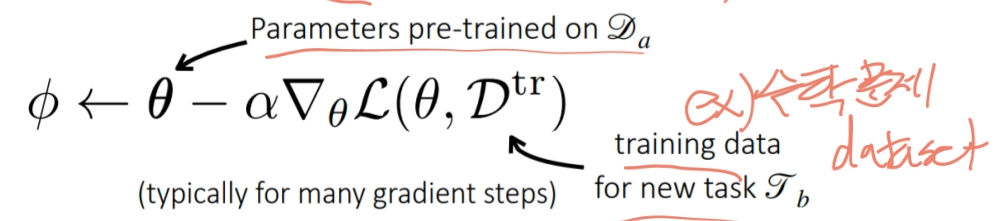
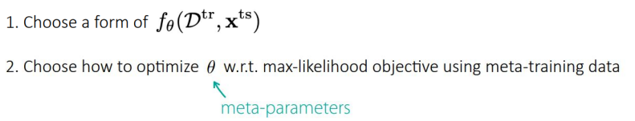
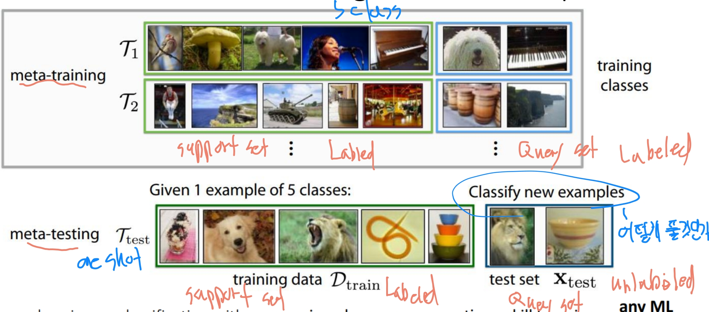
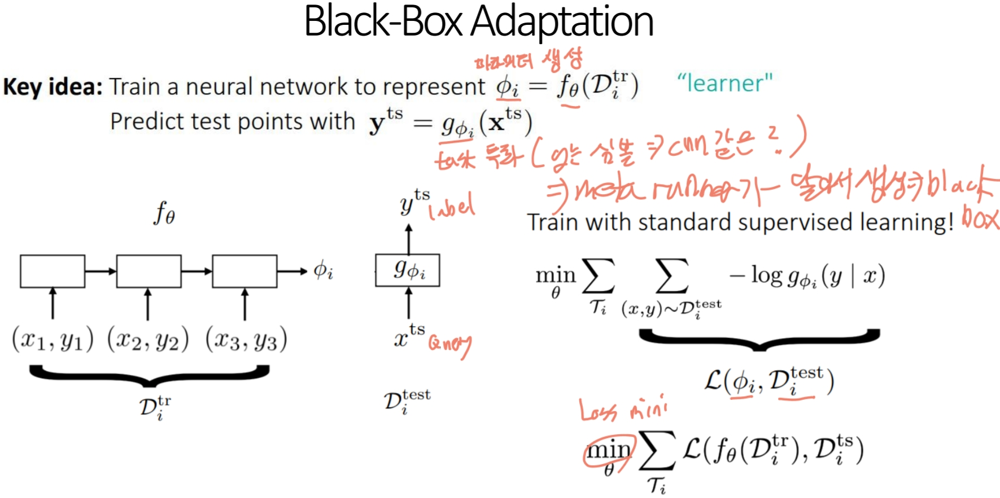
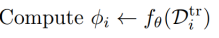
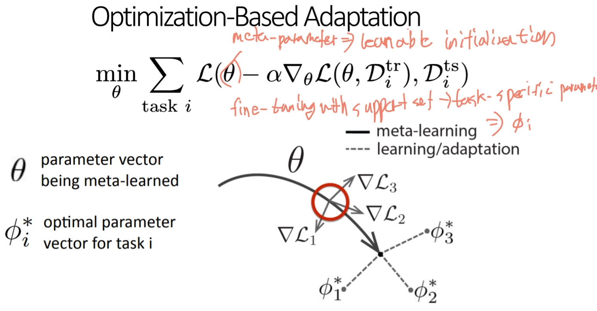
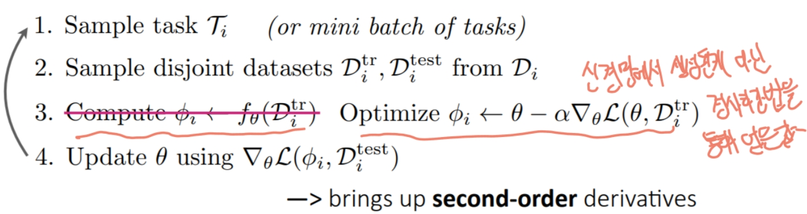
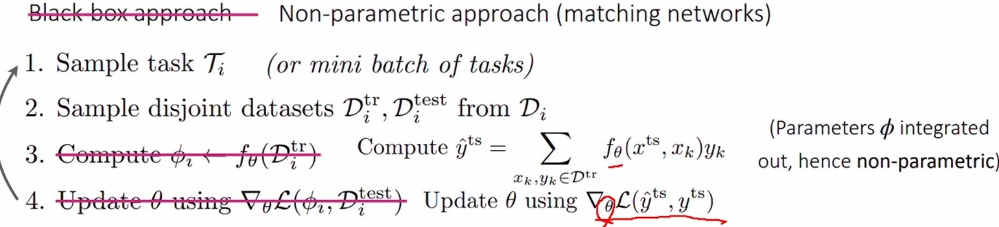
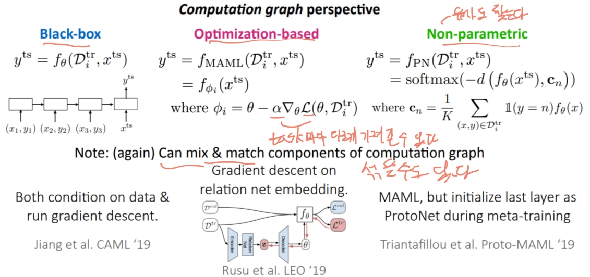

# Intro

## Why Multi-task Learning & Meta-learning?
- 전통적인 학습: 하나의 작업을 처음부터 학습
- 현실: 새로운 환경/작업에 빠르게 적응해야 함
- 인간은 Generalist, 기계는 Specialist → 일반화 필요
- 대규모 데이터 부족, Long-tail 문제, 빠른 적응 요구
- 이에 대한 해결책: 멀티태스크 학습, 메타러닝, Few-shot Learning

## 핵심 주제
### Multi-task Learning (MTL)
- 여러 작업을 동시에 학습하여 효율 향상
- 예: 추천 시스템, 다중 언어 번역 등
- Shared structure(공통 구조)를 이용함
- 수식
  - 
  - 
  - 모델을 Zi(task descriptor)에 어떻게 조건화해야 할까요? 모델의 어떤 매개변수를 공유해야 할까요?
  - task마다 모델을 따로 가져가는 것은 공유가 없어서 좋은 방식이 아니다.
  - 아래와 같이 적당한 최적의 지점을 찾는게 좋다.
  - 
- z conditioning 방식의 4가지 종류.
  1. Concatenation-based Conditioning
     - Task-specific 벡터 또는 embedding을 공유 표현 z에 단순히 concat하여 입력으로 사용
     -  
  2. Additive Conditioning
     - input과 z를 각각 linear layer를 통과시켜서 더한 후, 출력
     - 
  3. Multiplicative Conditioning
     -  input과 linear layer를 통과한 z를 곱한 후, 출력
     - 
  4. Multi-head Architecture
     - 공통레이어와 각 task별 레이어를 나눈다.
     - 

#### Objective function

어떻게 wi를 선택해야 할까?
- 중요도 또는 우선순위에 따라 수동으로
- 훈련 전반에 걸쳐 동적으로 조정

#### Optimizing the objective
1. task의 미니배치 샘플링
2. 각 task에 대한 데이터포인트 미니배치 샘플링
3. 미니배치에서 로스 계산
4. 역전파를 통한 기울기계산
5. 선호하는 신경망 최적화도구를 사용하여 기울기 적용

#### Multi-Task Learning의 주요 Challenges
- Task 간 Negative Transfer(부정적 전이)
  - 서로 다른 작업 간의 지식 공유가 오히려 성능 저하를 초래
  - 그렇다면 덜 공유해보자
  - 매개변수 공유의 더 유동적인 정도를 허용합니다.
  - 
- overfitting
  - 충분히 공유하지 않을 경우 오버피팅 발생
  - 더 공유해서 해결
- task가 너무 많다면?
  - 아직 연구중

#### Case Study
- YouTube 추천 시스템
  - input : 현재 보고 있는 비디오(query video), user features
  - output : 후보 비디오에 대한 맞물림(클릭 여부), 만족(좋아요 클릭, 별점)

### Transfer Learning
- 이전 작업의 지식을 활용하여 새로운 작업에 빠르게 적응
- 새로운 Task를 학습 시에는 이전 Task에서 사용한 데이터셋은 사용하지 않음
- transfer learning은 MTL에 대한 유효한 solution이라 볼 수 있다.
* 전이 학습이 의미가 있을 수 있는 문제/응용 분야에는 어떤 것이 있나요?
  - 이전 데이터셋이 클 경우
- fine-tuning에서의 수식
  - 
  - Distribution Shifts를 할 때 특정 layer만 fine-tuning할때 성능이 좋아질 수도 있다.
  - fine-tuning에 데이터가 적으면 효과가 적은데 이 때 메타러닝이 도움이 될 수 있다.
- transfer learning의 경우 target task가 fine-tuning을 통해 더 잘되기를 바라는 것인데 메타러닝은 직접 최적화를 하는 것이다.

### Meta Learning (Learning to Learn)
- 학습 알고리즘 자체를 학습, 공통된 지식(구조)를 찾아간다.
  - 
- Multi-Task Learning(여러 task 학습) + Transfer Learning(새로운 task 해결)
- 데이터 부족 시대에서 학습 일반화가 중요해짐
- 빠른 적응, few-shot 학습 가능(GPT few shot이 예제), 오버피팅 완화
- 두 관점으로 봄
  - Mechanistic view(기계적 관점)
    - 전체 데이터를 학습하고 예측을 하는 딥러닝
    - 이 네트워크를 훈련하는 데는 메타 데이터 세트를 사용하는데, 이 데이터 세트 자체는 각각 다른 작업을 위한 여러 데이터 세트로 구성됩니다.
  - Probabilistic view(확률적 관점)
    - 새로 task가 들어왔을때 우리가 사전에 배웠던것과 비슷한 것을 찾고 빨리 학습하고자 하는 개념
  - Bayesian View
    - 사전지식을 알고있으면 각 Pi에 대한 정보가 주어지고 Pi 구분 능력이 더 강화된다.
    - 공통된 사전지식을 배우고 사전지식을 통해서 새로운 task를 더 수월하게 학습한다.
- 작동 방법
  - 
- shared structure가 가지는 의미
  - 여러 개의 task들이 공통적으로 가지는 구조를 학습하여 공유한다는 의미이다.

### 대표 기법
- 블랙박스 접근법 (Black-box approaches)
- 최적화 기반 메타러닝 (Optimization-based meta-learning)
- 메트릭 러닝 (Metric learning)

### Black Box Meta-Learning
Meta-Learner 자체가 하나의 거대한 네트워크이고 어떤 방식으로 학습을 해나갈지 내부적으로 스스로 학습한다.

#### 수행 절차
1. task를 샘플링(혹은 미니배치)
2. suport set과 query set으로 나누기
3. 
4. prediction과 label을 비교하여 loss 계산, backpropagation해서 세타 파라미터 업데이트

#### Black Box challenge
- 사이즈가 큰 모델일 경우 전체 파라미터를 업데이트하기엔 비효율적이라 일부만 할 수도 있다.

#### 장단점
- 어떤 모델이든 가능하지만 모델이 복잡할 경우 최적화에 문제가 있을 수 있다.
- 다양한 학습 문제와 쉽게 결합 가능
- 데이터가 많이 필요하다.

### Optimization-based Meta-Learning
Meta-Learning에서 여러 task에 빠르게 적응할 수 있도록, 모델의 파라미터 최적화 과정을 설계하거나 초기화하는 방식.

- 대표 알고리즘으로 MAML(Model-Agnostic Meta-Learning)
  - 모든 task에 공통적으로 쓸 수 있는 초기 파라미터  θ를 학습
  - 핵심은 adaption은 Inner loop(fine-tuning - 바깥 loss안에 첫 값), meta-optimization은 Outer loop에서 수행
  - gradient 계산이 2번이라 계산비용이 올라감.

#### 수행 절차

#### Optimization-based challenge
- 구성
  - Inner loop: task-specific 파라미터를 support set으로 학습
  - Outer loop: query set 성능을 기준으로 초기 파라미터(meta-parameter)를 업데이트
- 우선 장점
  - 좋은 초기 inductive bias(유도 편향) 를 학습, 오버피팅 방지
  - 일반화(extrapolation) 성능이 좋다
  - 깊은 네트워크를 사용하면 표현력(expressiveness) 이 매우 뛰어남
  - 모델에 구애받지 않음, 어떤 구조든 적용 가능
- bi-level 최적화는 불안정성이 있을 수 있다.
  - 내부 벡터 학습률을 자동으로 학습하고 외부 학습률을 조정합니다.
  - inner loop의 일부 파라미터만 최적화한다.
  - 학습률을 각 스텝별로 다르게 가져간다.
- 역전파 하면서 계산량과 메모리가 많이 필요하다.
  - First-order Approximation(2차 미분 생략)
  - 마지막 레이어만 최적화

### Non-parametric methods
Non-parametric learner를 사용하는 것이며 test data와 training data의 유사도(distance metric)를 구하는 것이다.
- 여기서 distance metric을 학습하는게 non-parametric meta learning이다.

#### 수행 절차

#### non-parametric challenge
- 데이터 포인트 간의 더 복잡한 관계에 대해 추론해야 한다면 어떨까요?
  - 임베딩에 대한 비선형 관계 모듈 학습
  - 무한한 프로토타입 혼합을 배우다
  - 임베딩에 대한 메시지 전달 수행

#### 헬스케어와 같은 데이터를 얻기 힘들고 데이터가 long-tail 형태인 경우 적용되는 케이스가 있다.

#### 장단점
- 장점
  - 대부분 아키텍처에 표현력이 좋다
  - 빠르고 최적화가 쉽다
- 단점
  - k개수가 변하거나 너무 크면 이슈가 있다.
  - 분류에 제한이 있다.

### Compare
