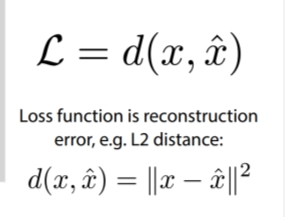
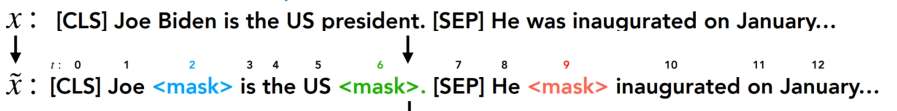
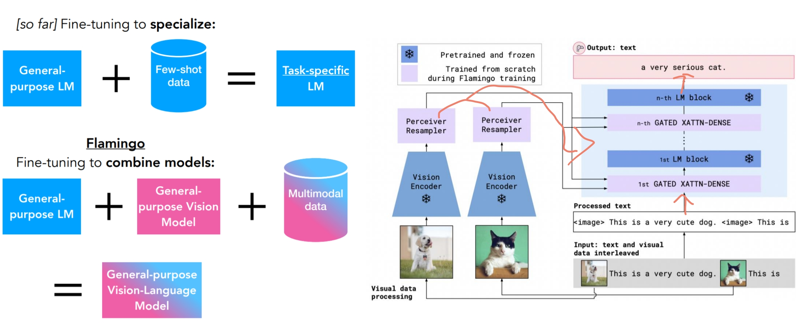
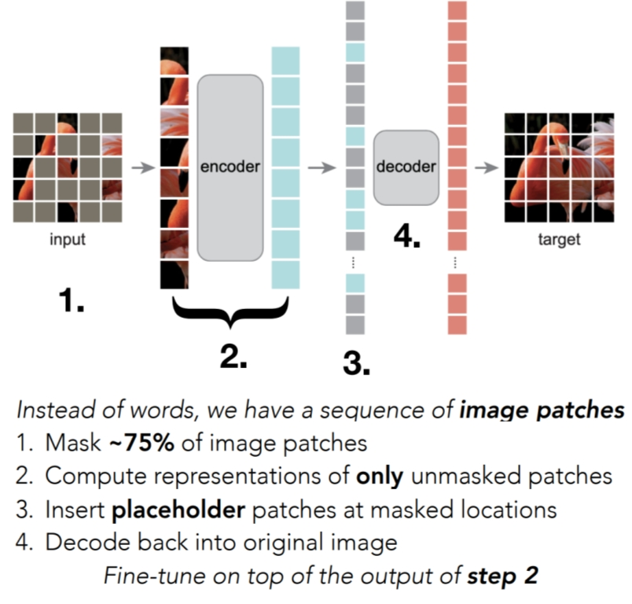

# Reconstruction
Reconstruction-based unsupervised pre-training은 입력 데이터를 스스로 복원하는 작업을 통해 의미 있는 표현(representation)을 학습하는 방법
> 즉, 원래 입력을 압축하고 다시 복원하면서 중요한 특징을 학습하게 만드는 방식

## formal

## AutoEncoders few-shot learning
- 장점
  - 간단하고 일반적
  - dinstance를 어떻게 가져가는가
  - 긍정/부정 쌍 선택이 필요하지 않다.
- 단점
  - bottleneck 디자인이 필요하다
  - 상대적으로 낮은 few shot 성능
  - 데이터가 많이 기억되어 그대로 재생성될 수 있으니 학습을 어렵게 만들어 더 좋은 표현을 하게끔 노력이 필요함.
    - 그래서 masked autoencoder 개념을 적용하여 이미지에 마스킹을 하여 학습을 시킨다.
    - autogressive는 생성모델로 가져갈 수 있다.

### case study - BERT as a masked autoencoder

### case study - Flamingo - autoregressive model(생성)

#### MAE for images

