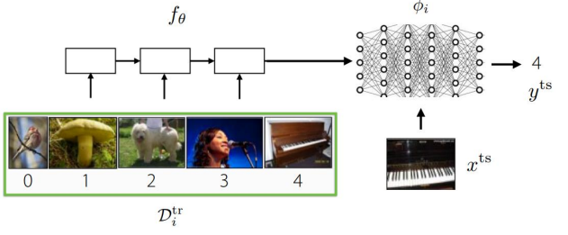
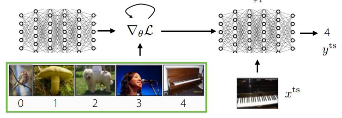
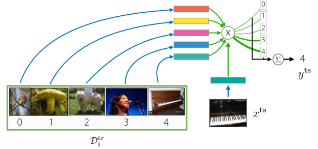

# Task Construction

## Intro
1. Memorization in Meta-Learning
   - 메타러닝에서 암기(memorization) 현상이 발생하는 시점과 문제.
   - Potential solutions: 암기 문제를 방지하거나 완화하기 위한 가능한 해결책들.
2. Meta-Learning without Tasks Provided
   - 주어진 태스크(task) 없이 수행하는 메타러닝, 즉:
     - Unsupervised Meta-Learning:
     - Semi-Supervised Meta-Learning
   - task label 없이도 메타러닝을 가능하게 하는 접근들을 다룸
3. Goals for by the end of lecture
   - memorization이 메타러닝에서 언제, 어떻게 발생하는지 이해.
   - constructing tasks automatically: 태스크를 자동으로 구성하는 기술을 이해.

### 메타러닝 기법 Recap
1. Black Box Meta Learning
   - 학습 알고리즘 자체를 신경망으로 표현함으로써, 메타 학습 대상 모델이 복잡한 태스크에 대해 적응할 수 있게 합니다.
   - 
     - 입력(학습용 데이터셋(𝐷𝑖^𝑡𝑟)): 메타 태스크𝑖에 대해 주어지는 학습 데이터는 이미지와 레이블 쌍으로 구성되어 있음.
     - fθ(메타러너(Meta-Learner)): 입력 데이터를 받아 특정 태스크에 맞는 임베딩 또는 내부 표현 𝜙𝑖를 생성
     - φi(태스크-특화 내부 표현): 이 표현은 새로운 입력 x를 넣어 예측값 y를 출려하게 도와줌
     - 출력(y): 예측된 값
   - 장점
     - 블랙박스 구조는 표현력이 높아 다양한 태스크에 적용 가능
   - 단점
     - 최적화가 어렵고, 학습 안정성이 떨어질 수 있음
2. Optimization-based Meta Learning
   - 학습자(learner)를 최적화 과정을 통해 직접 조정하는 접근, 블랙박스 방식과 달리 내부 최적화 과정의 구조를 명시적으로 포함
   - 
     - 입력(학습용 데이터셋(𝐷𝑖^𝑡𝑟)): 5개의 이미지 (새, 버섯, 강아지, 사람, 피아노)에 대응하는 레이블(0~4)을 포함한 태스크 전용 훈련 데이터.
     - 내부 학습 과정: 입력 데이터를 바탕으로 손실함수 L에 대해 파라미터 θ를 업데이트, 이 gradient descent step을 통해 각 태스크에 특화된 파라미터 𝜙𝑖가 생성됩니다
     - 출력(y): 예측된 값
   - 장점
     - 최적화 구조를 그대로 내재화해 학습이 더 직관적이고 일반화에 강함
   - 단점
     - 미분의 미분 (Hessian 등)을 포함한 2차 최적화 기법이 필요하여 계산 비용이 큼
   - 이 방식은 대표적으로 MAML에서 사용되며, 빠른 적응(1~2스텝 fine-tuning)을 목표로 합니다
3. Non-Parametric Meta Learning
   - 모델에 학습되는 파라미터가 없거나 거의 없으며, 대신 데이터 자체의 구조와 유사도를 기반으로 판단하는 방법
   - 
     - 입력(학습용 데이터셋(𝐷𝑖^𝑡𝑟)): 5개의 이미지
     - 임베딩 및 거리 계산
       - 각 훈련 샘플은 고정된 임베딩 공간에 매핑되며, 테스트 입력 X𝑡𝑠도 같은 방식으로 임베딩됩니다.
       - 이 테스트 임베딩과 각 훈련 샘플 간의 유사도 또는 거리(distance)를 계산하여, softmax를 통해 가중합 방식으로 예측을 생성합니다.
     - 출력(y): 가장 가까운 임베딩들을 기반으로 클래스 확률을 추정하여 분류
   - 장점
     - 별도 파라미터 학습이 적고 계산 비용이 낮아 빠름
     - 구조상 분류 문제에만 적용되기 쉬우며, 회귀(regression)에는 부적합

## Memorization in Meta-Learning(Problem)
|-|-|-|
|항목|메타러닝|일반지도학습|
|과적합 대상| task 함수 f| 데이터셋|
|과적합 이름| meta overfitting|standard overfitting|
|정규화 방식| meta regularization|standard regularization|
|목적| 메타 파라미터의 표현련 제한| 모델 파라미터의 복잡도 제한|

### Supervised Task Construction
주어진 라벨링된 데이터를 바탕으로 다수의 task를 구성하는 방법, 특히 메타러닝에서는 기존 태스크들로부터 새로운 태스크에 빠르게 적응할 수 있는 학습 구조를 설계하는 것이 핵심

#### 예시
1. N-way Image Classification
   - 학습 태스크들을 메타러닝에 사용하여, 모델이 새로운 태스크에 few-shot으로 적응할 수 있도록 합니다.
2. Regional Adaptation
   - 지리적 영역마다 특징이 다르기 때문에, 이전 지역의 라벨 데이터를 바탕으로 다른 지역에 적응할 수 있는 메타러닝 모델을 구성
3. Few-shot Imitation Learning
   - 이전 태스크(컵 잡기, 물 붓기 등)를 바탕으로 새로운 유사한 태스크를 학습할 수 있도록 합니다

### 요점
1. 태스크 식별자(task identifier)를 모델 입력으로 사용할 때 발생할 수 있는 memorization 문제 
   - 문제: 모델이 학습 시 태스크 식별자에 과도하게 의존하여 일반화 실패할 수 있음.
   - 교훈: 메타러닝에서는 데이터 기반 학습을 유도(암기하는지 학습하는지?)
2. 텍스트로 된 태스크 설명(paragraph description)을 입력으로 사용하는 상황
   - 문제: 태스크의 목적/구조를 자연어로 표현, 설명과 데이터 중 더 쉽게 일반화 가능한 쪽에 의존
   - 교훈: 메타러닝 시스템이 태스크 정보를 어떤 방식으로 이해하고 일반화하는지를 설계 단계에서 신중히 고려해야 한다는 점을 강조
3. 동일한 이미지라도 태스크마다 다른 라벨을 가질 수 있음
   - 문제: 모델은 테스트 시, 학습 데이터(훈련 샘플)에서 라벨의 의미를 유추해야 함.
   - 교훈: 모델은 훈련 데이터를 통해 해당 태스크의 라벨 체계를 이해해야 함
4. 메타러닝의 태스크 구성 시 라벨 일관성
   - 문제: 모든 태스크에서 동일한 이미지가 동일한 라벨을 유지한다면 어떤 일이 일어날까?
   - 교훈: 모든 태스크는 사실상 하나의 큰 분류 문제로 통합됨, 메타러닝이 무의미. 그래서 태스크 간 라벨이 무작위로 부여되어야 함.
5. 메타러닝에서 라벨 순서 일관성(label order consistency)이 어떤 영향
   - 문제: 라벨 순서를 유지하는 것이 메타러닝 모델에 잘못된 힌트를 줄 수 있다
   - 교훈: 태스크별 라벨을 매번 무작위로 지정

### 그렇다면 모델이 단순히 암기하지 않도록 할 방법이 있는가?
- 라벨이 무작위로 섞인 경우
  - 단일 함수로 모든 태스크를 해결할 수 없음. 
  - 각 태스크가 서로 다른 쳬게를 가지므로 일반화 필요
- 라벨이 일관된 경우
  - 단일 함수로도 모든 태스크를 해결 가능.
  - 적응 기반 해법으로 해결
    - 정보 흐름을 조절하여 출력 y가 데이터 D에 의존하도록 유도
    - 대표적 해결기법: Meta-Regularization
      - θ 내부에 너무 많은 정보를 저장하지 못하도록 제약, 대신 데이터 D로 부터 필요한 정보 얻게 함

## Meta-Learning without Tasks Provided
라벨이 없는 이미지(unlabeled images)만으로 메타러닝(meta-learning)을 할 수 있는가?

### 비지도학습 메타러닝의 일반적인 생성 방법
- 주요 목표: 라벨이 없는 데이터셋을 사용하여 자동적으로 task 구성
- 생성 단계
  1. 입력: Unlabeled dataset
  2. 태스크 구성: 적절한 기준으로 클러스터링, 구조를 잡아 task 생성
  3. 메타러닝 수행: 구성한 task들로 meta-train
- task 구성시 고려할 요소
  - 다양성, 구조성(few shot 가능하려면 일관된 구조)
- 성능은 지도학습 기반에 메타러닝에 비해 낮지만, 라벨 없는 상황에선 유의미함

### 도메인 지식을 task 구성에 사용할 수 있을까? 
도메인 지식이 있다면, 변형(drop-out, translation, reflection)이 있어도 이미지의 의미는 변하지 않음

- 생성 단계
  1. 무작위로 N개의 이미지를 선택하고 라벨을 할당
  2. 각 이미지에 대해 도메인 지식을 활용해 데이터 증강 수행
- 도메인 지식이 잘 작동하는 이미지셋에서는 효과적이지만 자연 이미지처럼 복잡한 도메인에서는 효과가 떨어질 수 있음

### 그래서 결론적으로 라벨 없는 텍스트만으로도 메타러닝이 가능한가?
1. Option A, GPT-3처럼 다음 단어 예측을 통한 사전학습으로 메타러닝을 수행
   - 다양한 task를 모두 다음 토큰 예측 문제로 통일
   - 한계
     - classfication에는 적용이 어려움
     - optimization-based meta-learning 방식과의 결합이 어려움
2. Option B, 마스킹 기반 태스크 생성
   - 마스킹된 단어를 예측하는 태스크를 만들고, 이를 통해 메타러닝 수행

### 테스크 생성 방식
- 프로세스
  1. 입력: unlabled dataset
  2. task 구성
     - 임베딩 공간에서 클러스터링된 이미지 그룹 간 구분 과제를 생성 (예: CACTUs)
     - 동일 이미지의 증강본과 전혀 다른 이미지를 구분하도록 학습 (예: contrastive task)
     - 주어진 문맥으로부터 다음 텍스트를 생성 (예: GPT-style 언어 모델링)
     - 문장에서 마스킹된 단어를 맞추는 과제 생성 (예: BERT-style MLM, SMLMT 방식)
  3. 생성된 task로 meta learning 수행